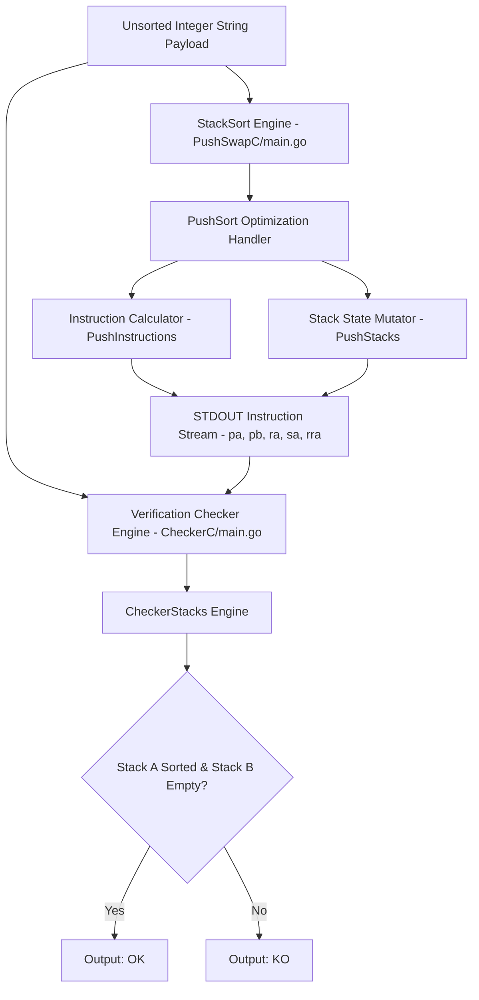
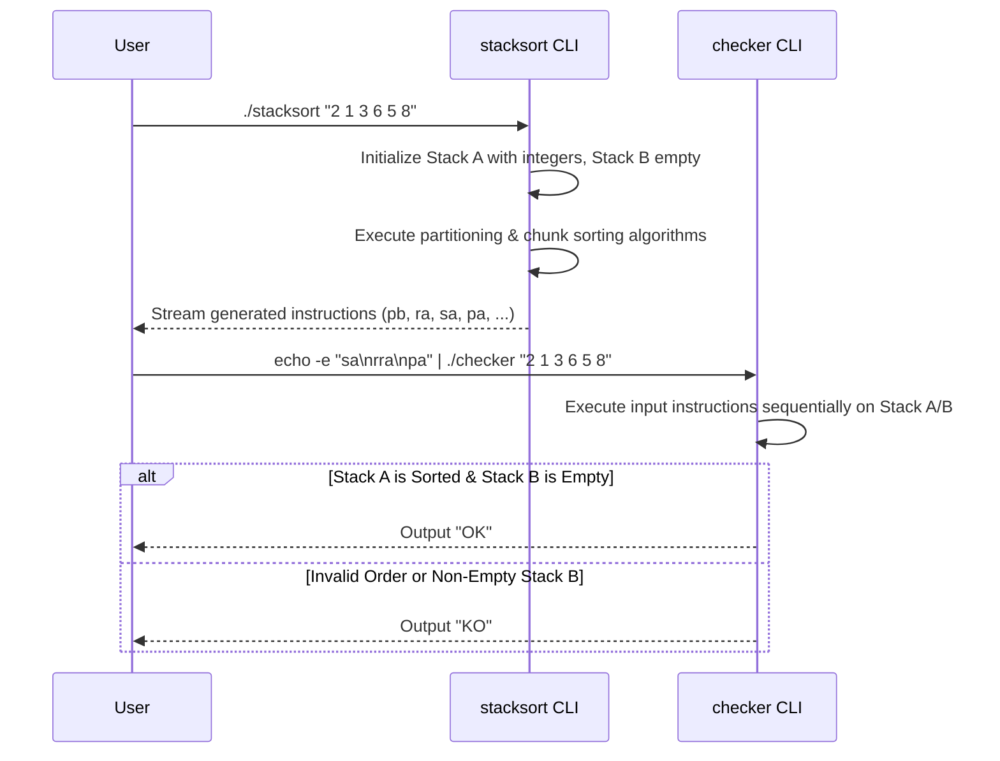

# 🥞 StackSort

[](https://go.dev)
[](LICENSE.md)

**StackSort** is a high-efficiency dual-stack sorting algorithm generator and verifier implemented in Go. It computes the absolute minimal sequence of push, swap, and rotate operations required to sort an unorganized list of integers across two auxiliary stack structures (`Stack A` and `Stack B`).

---

## ⚡ Key Highlights

- **Dual Binary Architecture**: Includes both `stacksort` (instruction generator) and `checker` (instruction validation engine).
- **Instruction Optimization Constraints**: Guaranteed instruction thresholds:
  - 3 elements: \(\le 3\) instructions
  - 5 elements: \(\le 12\) instructions
  - 100 elements: \(\le 1500\) instructions
  - 500 elements: \(\le 11500\) instructions
- **Primitive Stack Operations**: Implements atomic operations:
  - **Push**: `pa` (push top B to A), `pb` (push top A to B).
  - **Swap**: `sa` (swap top 2 A), `sb` (swap top 2 B), `ss` (simultaneous `sa` + `sb`).
  - **Rotate**: `ra` (shift up A), `rb` (shift up B), `rr` (simultaneous `ra` + `rb`).
  - **Reverse Rotate**: `rra` (shift down A), `rrb` (shift down B), `rrr` (simultaneous `rra` + `rrb`).

---

## 📋 Table of Contents

- [Key Highlights](#-key-highlights)
- [System Architecture](#-system-architecture)
- [Sorting & Verification Flow](#-sorting--verification-flow)
- [Setup & Execution](#-setup--execution)
- [Project Directory Structure](#-project-directory-structure)
- [License](#-license)

---

## 🏗️ System Architecture



---

## 🖥️ Live Terminal & Pipeline Verification Preview

Below is a live shell trace demonstrating StackSort generating instructions for an unsorted set of numbers and piping the instructions into `checker` for validation:

```text
$ ARG="4 67 3 1 2 9 8 5"
$ ./stacksort "$ARG"

pb
pb
pb
sa
ra
pa
pa
pa
ra

$ ./stacksort "$ARG" | ./checker "$ARG"
OK

$ ./stacksort "$ARG" | wc -l
9
```

---

## 📐 Sorting & Verification Flow



---

## 🚀 Setup & Execution

### Prerequisites

- **Go**: Version 1.20 or newer installed.

---

### Build & Run

1. **Clone Repository**:
   ```bash
   git clone https://github.com/sahmedhusain/stacksort.git
   cd stacksort
   ```

2. **Compile Binaries**:
   ```bash
   go build -o stacksort PushSwapC/main.go
   go build -o checker CheckerC/main.go
   ```

3. **Generate Sorting Instructions**:
   ```bash
   ./stacksort "2 1 3 6 5 8"
   ```

4. **Verify Instruction Correctness with Checker**:
   ```bash
   ARG="2 1 3 6 5 8"; ./stacksort "$ARG" | ./checker "$ARG"
   ```
   *Expected Output: `OK`*

5. **Measure Instruction Count**:
   ```bash
   ARG="2 1 3 6 5 8"; ./stacksort "$ARG" | wc -l
   ```

---

## 📂 Project Directory Structure

```
stacksort/
├── go.mod                     # Go module manifest (module stacksort)
├── README.md                  # Documentation
├── test.sh                    # Verification test script
├── PushSwapC/
│   └── main.go                # Entrypoint for instruction generator binary
├── CheckerC/
│   └── main.go                # Entrypoint for validation checker binary
└── Functions/
    ├── PushSort/              # Core sorting algorithm routines
    ├── PushInstructions/      # Instruction formatting and output string builders
    ├── PushStacks/            # Generator stack operations (push, swap, rotate)
    └── CheckerStacks/         # Checker stack operations and verification rules
```

---

## 📄 License

Distributed under the MIT License. See [LICENSE](LICENSE.md) for details.
